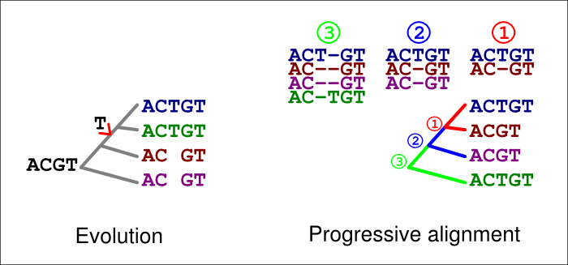
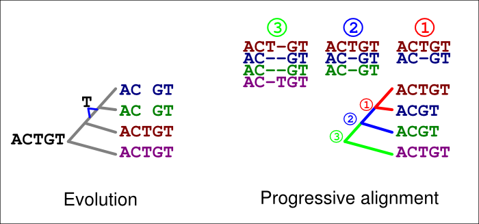
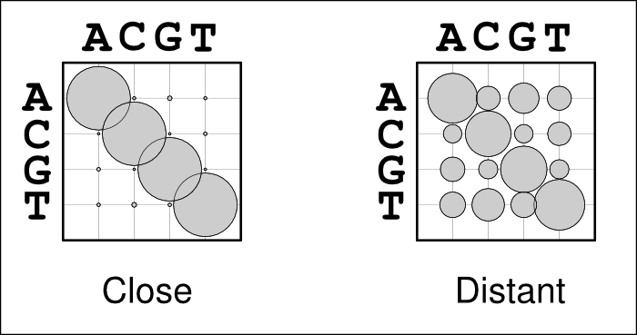

PRANK differences
=================

[Back to PRANK home.](../README.md)  

PRANK aims at an evolutionarily correct sequence alignment. It uses evolutionary information for the placement of gaps and modelling of the substitution process. When this information is correct, PRANK makes superior alignments compared to other progressive methods. However, when its assumptions are violated, the program’s performance may be significantly affected. Below is a brief description of potential problems caused by an incorrect alignment guidetree.

#### Tree topology

All progressive alignment methods use a guidetree (although some methods seem to hide this fact!) that is meant to represent the evolutionary relationship between the sequences to be aligned. Ideally, the sequences’ phylogeny would be known in advance but often that is not the case and it has to be first inferred from the sequence data. Like many other methods, PRANK does that from genetic distances estimated from pairwise alignments using the neighbour-joining (NJ) algorithm.

This heuristic is highly error-prone. Pairwise alignments of distant sequences are likely to be less correct than the corresponding alignments in a full multiple alignment. Furthermore, the NJ algorithm does poorly with large numbers of sequences, especially if the internal branches are short.

In general, **the guidetree estimation is likely to work** when (A) the number of sequences is small, (B) the sequences are long and complete, and (C) the internal branches in the tree are not too short; **the guidetree estimation is likely fail** when (A) the number of sequences is high, (B) the sequences are short and incomplete, and (C) the internal branches in the tree are short.

In the default mode, PRANK tries to correct for these potential problems by iterating the alignment using an improved guidetree estimated from the first multiple alignment. There is a risk, however, that the initial alignment creates bias in the distance estimates and the iteration of the alignment is also biased.

PRANK uses phylogenetic information to infer if a gap in the alignment is caused by an insertion or a deletion. The option -F (or +F as defined in the paper), which makes the inferred insertions permanent (and that we have shown elsewhere to give a superior performance **when** the tree is correct), makes the algorithm especially sensitive to incorrect topologies. A wrong alignment order may make an insertion or a deletion to appear as multiple independent insertions.

In the figure below, the extra ‘T’ in the blue and green sequences is explained by an insertion in their common ancestor (left). If an incorrect guide tree is used for the alignment (right), a gap in the first alignment (1, red) is confirmed as an insertion by the second alignment (2, blue). If the option -F is used, the last alignment (3, green) cannot match the homologous ‘T’ at that site but has to place it in a column of its own.

A similar error can happen with deletions, too. In the figure below, a ‘T’ is now deleted in the common ancestor of the blue and green sequences (left). If an incorrect guide tree is used for the alignment (right), a gap in the first alignment (1, red) is confirmed as an insertion by the second alignment (2, blue). If the option -F is used, the last alignment (3, green) cannot match the homologous ‘T’ at that site but has to place it in a column of its own.

These errors are, of course, avoided if the guidetree topology is correct. They typically are also avoided if the option -F is not used; we have shown elsewhere, however, that this option and permanent insertions give a superior performance when the tree is correct.

#### Low-complexity sequence

The PRANK algorithm uses phylogenetic information to distinguish insertions from deletions. It assumes that sequence sampling is so dense that two sister branches (i.e., two consecutive alignments) have not had deletions of the same length at the same position. If that happens, the second deletion can confirm the first gap (caused by a deletion) as an insertion; if the option -F is used, this site is incorrectly marked as a permanent insertion and can not be matched in later alignments.

Whereas deletions at the same site should be unlikely in complex sequences, low-complexity sequences (such as microsatellites) are enriched with deletions and chances of independent deletions are much greater. Furthermore, the positions of deletions of identical repeat units are not known and the algorithm can move independent deletions to overlap, incorrectly inferring insertions when deletions have happened. On the other hand, traditional algorithms explain most insertion-deletion events in low-complexity sequence as deletions, which is also wrong.

#### Branch lengths

The guidetree also provides information of the expected similarity between the sequences to be aligned. Unlike many other progressive sequence aligners, PRANK uses this information and computes a substitution matrix reflecting the expected number of differences for each pairwise alignment (numbers 1,2 and 3 in the figure above). This, however, requires that the branch lengths of the guidetree approximately represent the genetic distances between the sequences at neutrally evolving sites.

The use of alignment-specific substitution matrices correctly takes into account the evolutionary history of sequences and reduces the chances of inferring false homologies. As an example, when aligning human and chimp sequences, we would expect most sites to be identical just because of their evolutionary relatedness; if the sequences are very different, they very likely are non-homologous and should not be matched. In a bubble-plot representation this looks like the matrix on the left in the figure below: the diagonal bubbles representing no change are big and the off-diagonal bubbles representing substitutions are small. In contrast, when aligning two distantly related sequences, e.g. from human and chicken, we expect the sequences to be different due to their great divergence time. Now, the substitution matrix would look like the one one the right: sequences show some similarity and the diagonal bubbles are still biggest, but the off-diagonal bubbles are significantly larger.

Problems may occur if the guidetree is estimated from sequence data that are in most parts highly conserved but do contain some more variable regions. In that case, the substitution matrix could look like the one on the left although it should look more like the one on the right. The highly conserved regions would, of course, be well aligned but the more variable regions would now look like non-homologous sequence and would not be matched but placed as insertions.

Ideally, the guidetree with branch lengths would be known in advance. Often that is not the case and they need to be estimated. The next best solution is then to have a representative sequence sample (including also long non-constrained regions) that is not dominated by the strictly conserved regions and gives reasonable estimates of sequence divergence at the variable regions. If that is not possible, it may be useful to manually enforce longer branch lengths using a specific command line parameter for PRANK. For example, the parameter -scalebranches=2 multiplies each branch length by 2 and thus accepts more mismatches between the sequences. This should make the alignment less stringent for sequences that are mostly conserved but contain short variable regions.

On the other hand, even the true branch lengths can be “too” long. Simulation studies have shown that neutrally evolving DNA sequences with a divergence of 0.4–0.5 subst/site or greater are not alignable. Such sequences may, however, contain conserved regions that are still alignable — the challenge is to match those alignable regions and avoid matching non-homologous sites. PRANK provides a command line parameter for that: for example, -maxbranches=0.15 sets the maximum branch length to 0.15 subst/site, i.e. guarantees that the expected divergence between the sequence pair to be aligned is never greater than 0.3 subst/site. If the sequence divergence is greater, those sites are not matched (because the correct homology is not recoverable and any alignment would not be much better than a random guess) but separated by gaps; if a sequence region is conserved, those sites are matched.